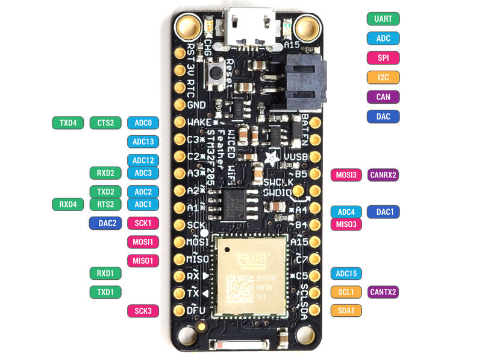

Documentation for WICED project.

BOM
====
* [WICED Feather](https://www.adafruit.com/products/3056)
* [2000mAh Lithium Ion battery](https://www.adafruit.com/products/2011)
* [FeaterWing Oled](https://www.adafruit.com/product/2900)
* 2 x [SCT 013-030 AC Current sensor](https://www.vanallesenmeer.nl/AC-current-sensor-SCT-013-030-(30A-max))
* 2 x [3.5mm Jack Female PJ-313D](https://www.vanallesenmeer.nl/Audio-Jack-SMD-3.5mm-Female-PJ-313D)

Pinout
=====

Links
=====

Adafruit WICED documentation:
* [WICED homepage](https://learn.adafruit.com/introducing-the-adafruit-wiced-feather-wifi)
* [NTP Problems and solutions](https://forums.adafruit.com/viewtopic.php?f=57&t=109493&start=0)